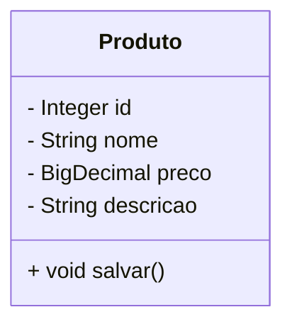

**Universidade Federal da Paraíba - UFPB** \
**Centro de Ciências Exatas e Educação - CCAE** \
**Departamento de Ciências Exatas - DCX**

**Professor:** [Rodrigo Rebouças de Almeida](http://rodrigor.dcx.ufpb.br)

# Implemente uma classe Produto que é persistida em um arquivo csv.

Deve ser possível armazenar a classe `Produto` em arquivos do tipo CSV.




```Java
public class Exemplo{
    public static void main(String[] args){
        Produto p = new Produto();
        p.setId(1);
        p.setNome("Produto 1");
        p.setPreco(new BigDecimal("10.00"));
        p.setDescricao("Descrição do produto 1");
        p.salvar();
    }
}
```

